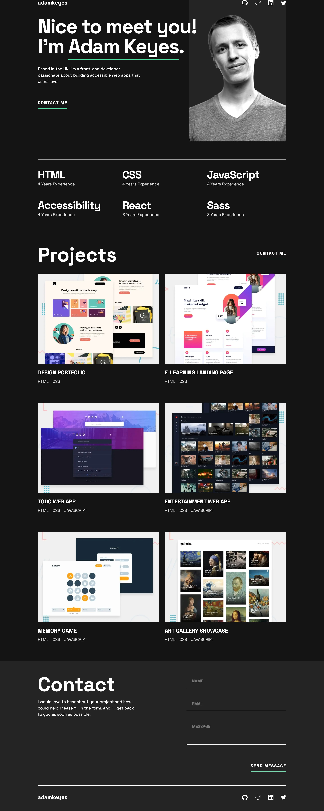

# Frontend Mentor - Single-page developer portfolio solution

This is a solution to the [Single-page developer portfolio challenge on Frontend Mentor](https://www.frontendmentor.io/challenges/singlepage-developer-portfolio-bBVj2ZPi-x). Frontend Mentor challenges help you improve your coding skills by building realistic projects.

## Table of contents

- [Overview](#overview)
  - [The challenge](#the-challenge)
  - [Screenshot](#screenshot)
  - [Links](#links)
- [My process](#my-process)
  - [Built with](#built-with)
  - [Useful resources](#useful-resources)
- [Author](#author)

## Overview

### The challenge

Users should be able to:

- Receive an error message when the `form` is submitted if:
  - Any field is empty
  - The email address is not formatted correctly
- View the optimal layout for the interface depending on their device's screen size
- See hover and focus states for all interactive elements on the page
- **Bonus**: Hook the form up so it sends and stores the user's enquiry (you can use a spreadsheet or Airtable to save the enquiries)
- **Bonus**: Add your own details (image, skills, projects) to replace the ones in the design

### Screenshot

### Links

- Solution URL: [Github](https://github.com/katrien-s/fe-24-006-single-page-developer-portfolio)
- Live Site URL: [Vercel](https://fe-24-006-single-page-developer-portfolio.vercel.app/)

## My process

### Built with

- Semantic HTML5 markup
- CSS custom properties
- Flexbox
- CSS Grid
- Mobile-first workflow

### Useful resources

- [Under the radar CSS features for your CSS reset](https://www.youtube.com/watch?v=cCAtD_BAHNw) - 2024-update to the CSS reset, adding a few new features.
- [The BEST way to do form validation in JavaScript](https://www.youtube.com/watch?v=iyngFd6f8ko) - YouTube-tutorial from (Code with Bubb)(https://www.youtube.com/@codewithbubb) on how to do form validation.
- [Accessibility Developer Guide](https://www.accessibility-developer-guide.com) - Hiding Elements
- [Accessible SVGs](https://a11y-101.com/development/svg) - Implement a11y on SVG's
- [Position the border-bottom of text](https://martinwolf.org/before-2018/blog/2012/09/positioning-the-border-bottom-of-inline-elements/). Though we didn't use this solution as the line would not break when the words do.

## Author

- Website - [Katrien Schuermans](https://www.katriens.be)
- Frontend Mentor - [@katrien-s](https://www.frontendmentor.io/profile/katrien-s)
